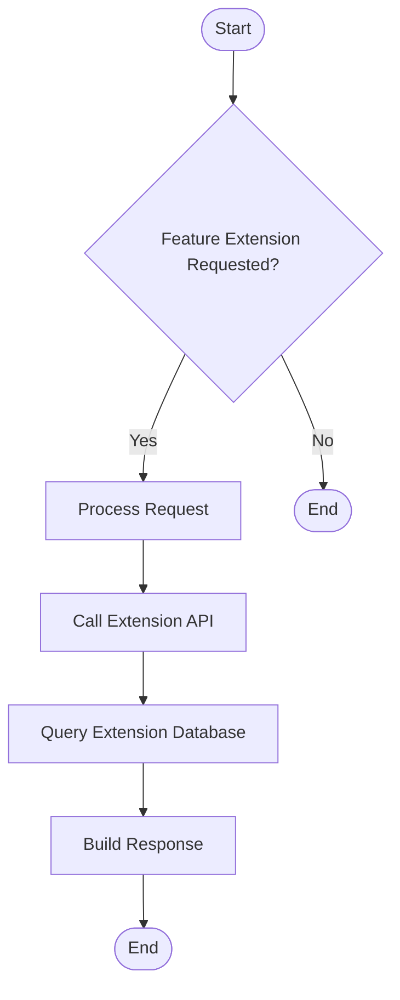

```mermaid
flowchart TD

    Start([Start]) --> Trigger{Feature Extension Requested?}

    Trigger -->|Yes| Process[Process Request]
    Trigger -->|No| End1([End])

    Process --> CallAPI[Call Extension API]
    CallAPI --> QueryDB[Query Extension Database]
    QueryDB --> BuildResponse[Build Response]
    BuildResponse --> End([End])


```