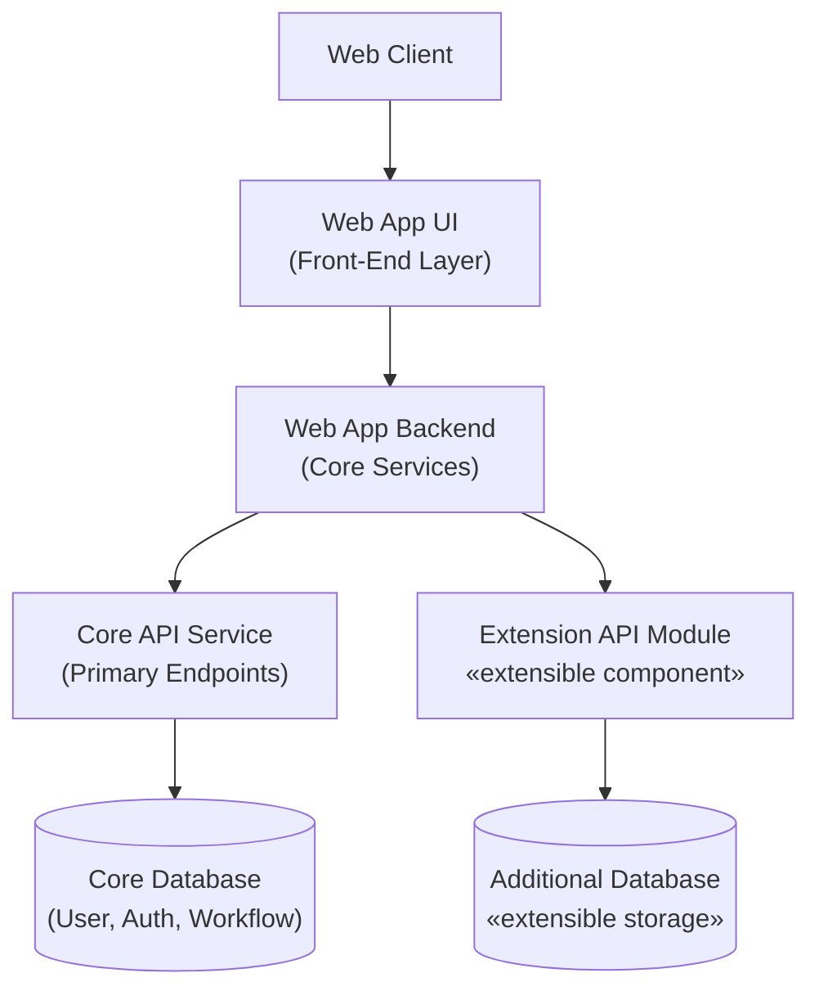

```mermaid
flowchart TB

    Client["Web Client"]
    UI["Web App UI\n(Front-End Layer)"]
    Backend["Web App Backend\n(Core Services)"]

    CoreAPI["Core API Service\n(Primary Endpoints)"]
    ExtAPI["Extension API Module\n«extensible component»"]

    CoreDB[("Core Database\n(User, Auth, Workflow)")]
    AddDB[("Additional Database\n«extensible storage»")]

    Client --> UI
    UI --> Backend

    Backend --> CoreAPI
    Backend --> ExtAPI

    CoreAPI --> CoreDB
    ExtAPI --> AddDB

```