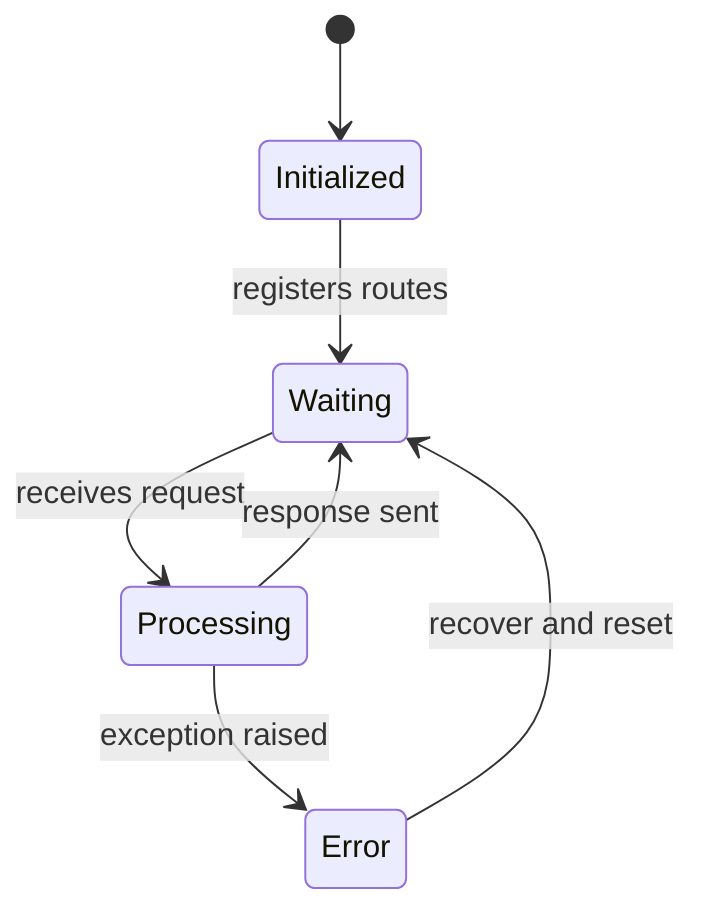

```mermaid
stateDiagram-v2
    [*] --> Initialized
    Initialized --> Waiting : registers routes
    Waiting --> Processing : receives request
    Processing --> Waiting : response sent
    Processing --> Error : exception raised
    Error --> Waiting : recover and reset

```