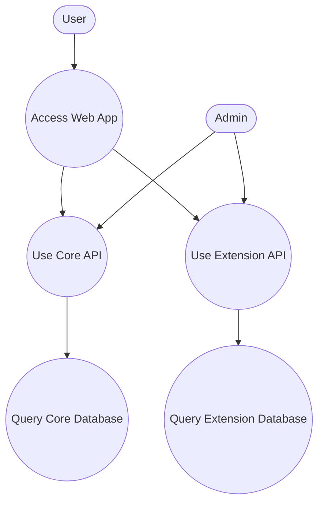

```mermaid

flowchart TB
    %% Use Case Diagram (Simulated UML)

    User([User])
    Admin([Admin])

    UC1((Access Web App))
    UC2((Use Core API))
    UC3((Use Extension API))
    UC4((Query Core Database))
    UC5((Query Extension Database))

    User --> UC1
    UC1 --> UC2
    UC1 --> UC3

    UC2 --> UC4
    UC3 --> UC5

    Admin --> UC2
    Admin --> UC3


```